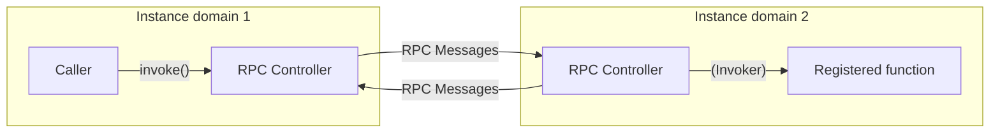

# Sublimity pure RPC engine

Core implementation of pure RPC engine in TypeScript.

[](https://www.repostatus.org/#wip)
[](https://opensource.org/licenses/MIT)
[](https://www.npmjs.com/package/asublimity-rpc)

----

## What is this?

Are you tired of struggling with the choice of RPC to use for intercommunication between systems, or of doing the same and different implementations over and over again?
This library is a pure RPC engine based on TypeScript, extracting only the core features of RPC.

You only need to consider the following two points:

* How to serialize/deserialize RPC messages (the simplest is just to `JSON.stringfy()`/`JSON.parse()`)
* Methods for sending and receiving RPC messages (any method is acceptable, including HTTP/WebSocket/IPC/Cloud MQ service, etc.)

Here is a simple conceptual diagram:



The RPC engine provides the following functionality:

* Identification of the calling function by identifier (string).
* Can use arbitrary values (primitive values, objects and function objects). Yes, can be specified as "Function object (callback functions)." The same applies to return values.
* All functions return `Promise<T>`, so they are fully asynchronous operation.
* Can expose asynchronous-generator `AsyncGenerator<T, void, unknown>`, it handles streaming value transfer.
* Arguments can be `AbortSignal`.

Function objects can be specified as arguments and return values. In other words, callback RPC is also supported.
RPC implementation, "Fully symmetric" and "Full-duplex" asynchronous mutual callable. Of course, callback RPC is included.

## Installation

```bash
npm install sublimity-rpc
```

## Usage

To get the Sublimity pure RPC engine working, you will need to perform the following two steps:

1. Create an RPC controller to send and receive RPC messages.
2. Register RPC callable functions in the RPC controller.

### Create and setup controller pair

Create Sublimity RPC controller each instance domain.

In doing so, specify a handler `onSendMessage` that handles RPC messages that should be sent to the peer controller.
It also calls `insertMessage()`, which tells the controller the RPC message received from the peer controller.

```typescript
import { createSublimityRpcController } from 'sublimity-rpc';

// Create Sublimity RPC controller
const controller = createSublimityRpcController({
  // Handler for RPC message sending
  onSendMessage: async message => {
    // S1. Serialize RPC message to JSON
    const messageJson = JSON.stringify(message);
    // S2. Send to the peer controller
    await fetch(
      'http://example.com/rpc', {  // Example using fetch API to send message
        method: 'POST',
        headers: { "Content-Type": "application/json" },
        body: messageJson
    });
  }
});

// ...

// R1. Got peer message from HTTP/SSE/WebSocket/MQ/etc...
const messageJson = ...

// R2. Deserialize peer message from JSON
const message = JSON.parse(messageJson);
// Insert peer message to controller
controller.insertMessage(message);
```

### Register functions

The following code exposes the `add` function to the peer controller.

Note that the function to be exposed returns `Promise`.
What types can be used depends on the types supported by serialization and reverse serialization.
If you are using TypeScript or JavaScript, you will find that you can specify JSON with almost the same feeling as accessing a Web API.

```typescript
// Register `add` function (asynchronous function)
const disposer = controller.register({
  // add: (a: number, b: number) => a + b
  'add',
  async (a: number, b: number): Promise<number> => {
    return a + b;
  }
);

// ...

// Remove `add` function
disposer.release();
```

Also, if you specify a function type, it will be automatically converted and replaced with the safest string possible.
So you don't have to worry about serialization.

```typescript
// Register a function with callback function
const disposer = controller.register({
  // foo: (f: (a: number) => Promise<string>) => await f(123) + 'DEF'
  'foo',
  async (f: (a: number) => Promise<string>): Promise<string> => {
    return await f(123) + 'DEF';
  }
);
```

### Invoke functions

Once you are ready, all you have to do is call the function:

```typescript
// Invoke `add` function with arguments
const result = await controller.invoke(
  // await add(1, 2)
  'add',
  1, 2);

expected(result).toBe(3);
```

### Callback functions

Yes, you can invoke with callback function:

```typescript
// Invoke `foo` function with function (callback) arguments
const result = await controller.invoke(
  // await foo(async (a: number) => a + 'ABC')
  'foo',
  async (a: number) => a + 'ABC');

expected(result).toBe(3);
```

### One-way invoking

Yes, you will NOT need any result for invoking:

```typescript
// Invoke one-way function, it returns void.
controller.invokeOneWay(
  // bar(1, 2, "BAZ")
  'bar',
  1, 2, "BAZ");
```

### Abort controller/signal

Yes, you can pass `AbortSignal` objects to functions:

```typescript
const controller = new AbortController();

await controller.invoke(
  // await hoge("haga", signal);
  'hoge',
  "haga", controller.signal);
```

### Synchronous RPC mode

By default, Sublimity RPC operates asynchronously, but it also supports synchronous RPC patterns. This is useful when working with communication layers that can return responses immediately, such as Electron IPC.

#### Using insertMessageWaitable()

When you need to get a response message directly, use `insertMessageWaitable()`:

```typescript
// Traditional async mode
controller.insertMessage(message); // fire-and-forget

// Synchronous mode - returns response message
const response = await controller.insertMessageWaitable(message);
// response will be the result/error/none message
```

#### Configuring onSendMessage() for synchronous mode

You can configure `onSendMessage()` to return a Promise with the response message:

```typescript
// Synchronous RPC mode (e.g., for Electron IPC)
const controller = createSublimityRpcController({
  onSendMessage: async message => {
    // Send and immediately get response
    const response = await ipcRenderer.invoke('rpc-channel', message);
    return response; // Return the response message
  }
});

// The controller will automatically use synchronous mode when onSendMessage returns a Promise
```

This mode provides better performance by avoiding the Deferred pattern when the communication layer supports synchronous request-response patterns.

### Async generators

Sublimity RPC supports async generators for streaming data transfer. You can register an async generator function and consume it on the peer side.

#### Register async generator

```typescript
// Register an async generator function
const disposer = controller.registerGenerator(
  'countUp',
  async function* (start: number, end: number): AsyncGenerator<number, void, unknown> {
    for (let i = start; i <= end; i++) {
      yield i;
    }
  }
);

// ...

// Remove generator function
disposer.release();
```

#### Consume async generator

```typescript
// Consume the async generator
const results: number[] = [];
for await (const value of controller.iterate<number>('countUp', 1, 5)) {
  results.push(value);
}

// results will be [1, 2, 3, 4, 5]
```

#### Advanced async generator usage

You can also use async generators with more complex data types and async operations:

```typescript
// Register generator with delay and complex data
const disposer = controller.registerGenerator(
  'dataStream',
  async function* (count: number): AsyncGenerator<{ id: number; timestamp: Date }, void, unknown> {
    for (let i = 0; i < count; i++) {
      await new Promise(resolve => setTimeout(resolve, 100)); // Simulate async work
      yield {
        id: i,
        timestamp: new Date()
      };
    }
  }
);

// Consume with complex data
for await (const data of controller.iterate<{ id: number; timestamp: Date }>('dataStream', 3)) {
  console.log(`Received: ${data.id} at ${data.timestamp}`);
}
```

#### Error handling in async generators

```typescript
// Generator that might throw errors
const disposer = controller.registerGenerator(
  'errorGenerator',
  async function* (throwAt: number): AsyncGenerator<number, void, unknown> {
    for (let i = 0; i < 5; i++) {
      if (i === throwAt) {
        throw new Error('Generator error');
      }
      yield i;
    }
  }
);

// Handle errors when consuming
try {
  for await (const value of controller.iterate<number>('errorGenerator', 2)) {
    console.log(value); // Will log 0, 1 before throwing
  }
} catch (error) {
  console.error('Generator error:', error.message);
}
```

----

## Misc.

This project is successor of [DupeNukem](https://github.com/kekyo/DupeNukem).
The key difference is that it is a true TypeScript independent library.
And I have refined the interface and internal structure.

## License

Under MIT.
