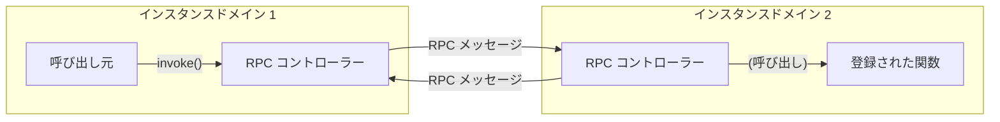

# Ameba pure RPC engine

TypeScript における純粋な RPC エンジンのコア実装。


[](https://www.repostatus.org/#active)
[](https://opensource.org/licenses/MIT)
[](https://www.npmjs.com/package/aameba-rpc)

----

[(English is here)](README.md)

## これは何ですか？

システム間の相互通信に使用する RPC の選択に悩んだり、同じような実装を何度も繰り返すことに疲れていませんか？
このライブラリは TypeScript ベースの純粋な RPC エンジンで、RPC の核心機能のみを抽出しています。

考慮すべきことは以下の 2 点のみです:

* RPC メッセージのシリアライズ/デシリアライズ方法（最もシンプルなのは `JSON.stringfy()`/`JSON.parse()` を使うだけです）
* RPC メッセージの送受信方法（HTTP/WebSocket/IPC/クラウド MQ サービスなど、どんな方法でも構いません）

以下がシンプルな概念図です:



RPC エンジンは以下の機能を提供します：

* 識別子（文字列）による呼び出し関数の識別。
* 任意の値（プリミティブ値、オブジェクト、関数オブジェクト）を使用可能。
* すべての関数は `Promise<T>` を返すため、完全に非同期な操作となります。
* 非同期ジェネレーター `AsyncGenerator<T, void, unknown>` を公開でき、ストリーミング値転送を処理します。
* 引数として `AbortSignal` を指定できます。

引数や戻り値として関数オブジェクトを指定できます。つまり、コールバック RPC もサポートされています。
RPC 実装は「完全対称」で「全二重」の非同期相互呼び出し可能です。

----

## インストール

```bash
npm install ameba-rpc
```

## 使用方法

Ameba pure RPC エンジンを動作させるには、以下の 2 つのステップを実行する必要があります:

1. RPC メッセージを送受信する RPC コントローラーを作成する
2. RPC コントローラーに RPC 呼び出し可能関数を登録する

### コントローラーペアの作成とセットアップ

各インスタンスドメインに Ameba RPC コントローラーを作成します。

その際、ピアコントローラーに送信すべき RPC メッセージを処理するハンドラー `onSendMessage` を指定します。
また、ピアコントローラーから受信した RPC メッセージをコントローラーに伝える `insertMessage()` を呼び出します。

```typescript
import { createAmebaRpcController } from 'ameba-rpc';

// Ameba RPC コントローラーを作成
const controller = createAmebaRpcController({
  // RPC メッセージ送信のハンドラー
  onSendMessage: async message => {
    // S1. RPC メッセージを JSON にシリアライズ
    const messageJson = JSON.stringify(message);
    // S2. ピアコントローラーに送信
    await fetch(
      'http://example.com/rpc', {  // fetch API を使用してメッセージを送信する例
        method: 'POST',
        headers: { "Content-Type": "application/json" },
        body: messageJson
    });
  }
});

// ...

// R1. HTTP/SSE/WebSocket/MQ/などからピアメッセージを取得...
const messageJson = ...

// R2. JSON からピアメッセージをデシリアライズ
const message = JSON.parse(messageJson);
// コントローラーにピアメッセージを挿入
controller.insertMessage(message);
```

### 関数の登録

以下のコードは `add` 関数をピアコントローラーに公開します。

公開する関数は `Promise<T>` を返すことに注意してください。
使用できる型は、シリアライズおよび逆シリアライズでサポートされる型に依存します。
TypeScript や JavaScript を使用している場合、Web API にアクセスするのとほぼ同じ感覚で JSON を指定できることがわかるでしょう。

```typescript
// `add` 関数を登録（非同期関数）
const disposer = controller.register({
  // add: (a: number, b: number) => a + b
  'add',
  async (a: number, b: number): Promise<number> => {
    return a + b;
  }
});

// ...

// `add` 関数を削除
disposer.release();
```

また、関数オブジェクトを指定すると、自動的に安全な識別子（文字列）に変換・置換されます。
そのため、シリアライズについて心配する必要はありません。

```typescript
// コールバック関数を持つ関数を登録
const disposer = controller.register({
  // foo: (f: (a: number) => Promise<string>) => await f(123) + 'DEF'
  'foo',
  async (f: (a: number) => Promise<string>): Promise<string> => {
    return await f(123) + 'DEF';
  }
});
```

### 関数の呼び出し

準備ができたら、あとは関数を呼び出すだけです:

```typescript
// 引数を指定して `add` 関数を呼び出し
const result = await controller.invoke(
  // await add(1, 2)
  'add',
  1, 2);

expected(result).toBe(3);
```

### 一方向の呼び出し

そう、呼び出しに結果は必要ありません:

```typescript
// 一方向関数を呼び出し、void を返します
controller.invokeOneWay(
  // bar(1, 2, "BAZ")
  'bar',
  1, 2, "BAZ");
```

### AbortController/AbortSignal

そう、関数に `AbortSignal` オブジェクトを渡すことができます:

```typescript
const controller = new AbortController();

await controller.invoke(
  // await hoge("haga", signal);
  'hoge',
  "haga", controller.signal);
```

### 非同期ジェネレーター

Ameba RPC はストリーミングデータ転送のための非同期ジェネレーターをサポートしています。
非同期ジェネレーター関数を登録して、ピア側で消費できます。

#### 非同期ジェネレーターの登録

```typescript
// 非同期ジェネレーター関数を登録
const disposer = controller.registerGenerator(
  'countUp',
  async function* (start: number, end: number): AsyncGenerator<number, void, unknown> {
    for (let i = start; i <= end; i++) {
      yield i;
    }
  }
);

// ...

// ジェネレーター関数を削除
disposer.release();
```

#### 非同期ジェネレーターの消費

```typescript
// 非同期ジェネレーターを消費
const results: number[] = [];
for await (const value of controller.iterate<number>('countUp', 1, 5)) {
  results.push(value);
}

// results は [1, 2, 3, 4, 5] になります
```

#### 高度な非同期ジェネレーターの使用法

より複雑なデータ型と非同期操作で非同期ジェネレーターを使用することもできます:

```typescript
// 遅延と複雑なデータでジェネレーターを登録
const disposer = controller.registerGenerator(
  'dataStream',
  async function* (count: number): AsyncGenerator<{ id: number; timestamp: Date }, void, unknown> {
    for (let i = 0; i < count; i++) {
      await new Promise(resolve => setTimeout(resolve, 100)); // 非同期処理をシミュレート
      yield {
        id: i,
        timestamp: new Date()
      };
    }
  }
);

// 複雑なデータで消費
for await (const data of controller.iterate<{ id: number; timestamp: Date }>('dataStream', 3)) {
  console.log(`Received: ${data.id} at ${data.timestamp}`);
}
```

#### 非同期ジェネレーターでのエラー処理

```typescript
// エラーを投げる可能性のあるジェネレーター
const disposer = controller.registerGenerator(
  'errorGenerator',
  async function* (throwAt: number): AsyncGenerator<number, void, unknown> {
    for (let i = 0; i < 5; i++) {
      if (i === throwAt) {
        throw new Error('Generator error');
      }
      yield i;
    }
  }
);

// 消費時のエラー処理
try {
  for await (const value of controller.iterate<number>('errorGenerator', 2)) {
    console.log(value); // 例外が投げられる前に 0, 1 をログ出力
  }
} catch (error) {
  console.error('Generator error:', error.message);
}
```

----

### 同期メッセージ送受信モード

デフォルトでは Ameba RPC は非同期的にメッセージを送受信しますが、同期メッセージ送受信パターンもサポートしています。
これは Electron IPC のような、`Promise<T>` で即座にレスポンスを返すことができる通信レイヤーを使用する場合に、より良いパフォーマンスを発揮します。

#### insertMessageWaitable() の使用

レスポンスメッセージを直接取得する必要がある場合は、`insertMessageWaitable()` を使用します:

```typescript
// (従来の非同期モード)
controller.insertMessage(message); // fire-and-forget

// 同期モード - `Promise<AmebaRpcMessage>` でレスポンスメッセージを返す
// 待機が完了すると、関数呼び出しも完了していることを示す
const response = await controller.insertMessageWaitable(message);
```

#### 同期モード用の onSendMessage() の設定

`onSendMessage()` をレスポンスメッセージを含む `Promise<AmebaRpcMessage>` を返すように設定できます:

```typescript
// 同期メッセージモード（例：Electron IPC 用）
const controller = createAmebaRpcController({
  onSendMessage: async message => {
    // 送信して即座にレスポンスを取得
    const response = await ipcRenderer.invoke('rpc-channel', message);
    // レスポンスメッセージを返す（`Promise<AmebaRpcMessage>`）
    // onSendMessage が Promise を返すとき、コントローラーは自動的に同期モードを使用します
    return response;
  }
});
```

----

## その他

このプロジェクトは [DupeNukem](https://github.com/kekyo/DupeNukem) の後継です。
主な違いは、これが真の TypeScript 独立ライブラリであることです。
そして、インターフェースと内部構造を洗練させました。

## ライセンス

Under MIT.
